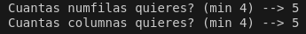
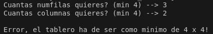
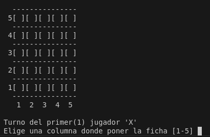
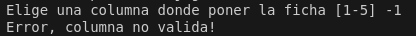
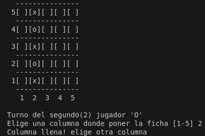
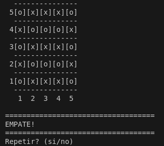
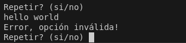
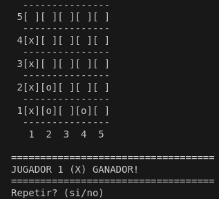

# ISMAEL DELGADO SANCHO
~~~
 =============================================
|                           _            ___  |
|                          | |          /   | |
|  ___ ___  _ __   ___  ___| |_ __ _   / /| | |
| / __/ _ \| '_ \ / _ \/ __| __/ _` | / /_| | |
|| (_| (_) | | | |  __/ (__| || (_| | \___  | |
| \___\___/|_| |_|\___|\___|\__\__,_|     |_/ |
|                                             |
 =============================================
~~~
## Conecta 4 en Java para el módulo M12 UF1 de DAW

### Tecnologias utilizadas:

- JAVA: Es un lenguaje de programación de propósito general, orientado a objetos.

- VSC: Visual Studio Code es un editor de código fuente gratuito, ligero y multiplataforma desarrollado por Microsoft.

- GIT: Es un sistema de control de versiones distribuido diseñado para gestionar y registrar los cambios en el código de un proyecto a lo largo del tiempo.

---

 Conecta 4 es un juego de mesa de estrategia para dos jugadores, donde el objetivo es alinear cuatro fichas de un mismo color en una fila, ya sea horizontal, vertical o diagonal, en un tablero vertical.

 Los jugadores alternan turnos insertando una ficha en cualquier columna, y la ficha cae hasta ocupar la posición más baja disponible. Gana el primero que logre conectar cuatro fichas consecutivas.

El programa Empieza pidiendo al usuario las medidas del tablero:

El programa contiene validacion en caso de intentar introducir filas o columnas por debajo del minimo:

Cuando el juego comienza primero se mostrara el tablero, junto a un mensaje donde se muestra el turno del jugado actual, para poder escribir la columna donde se desa poner la ficha:

Aqui tambien hay validación dependiendo si el jugador introduce una columna no existente, por ejemplo (-1):

El programa valida si se esta poniendo una ficha sobre una columna llena:

Tambien validará si el tablero queda lleno, en ese caso la partida habrá acabado en EMPATE:

Despues de un EMPATE o cuando un jugador logra hacer un 4 en raya, se preguntará por conola si se desea repetir la partida o no

Si se introduce un comando no valido a "si" o "no", lo pedirá otra vez:

El mensaje del ganador muestra el jugador:

